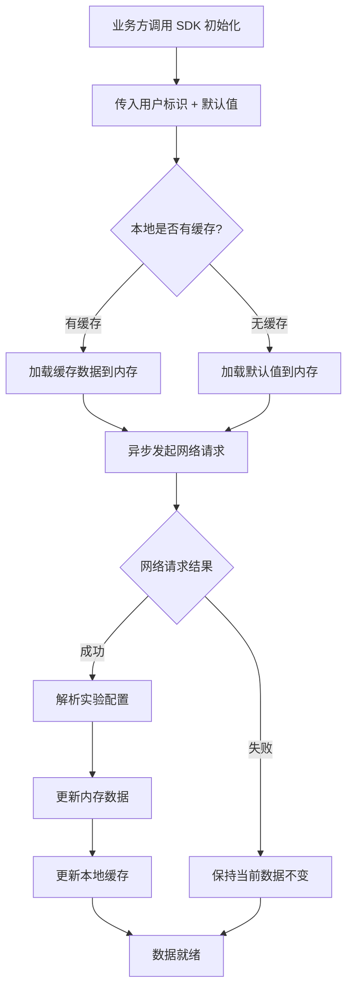
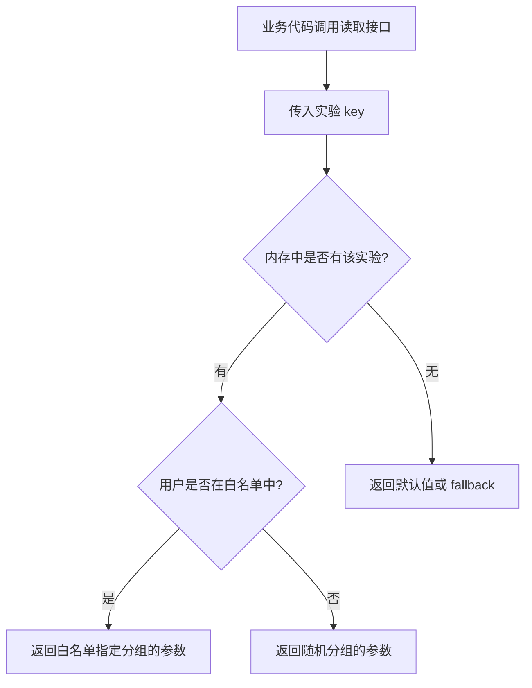
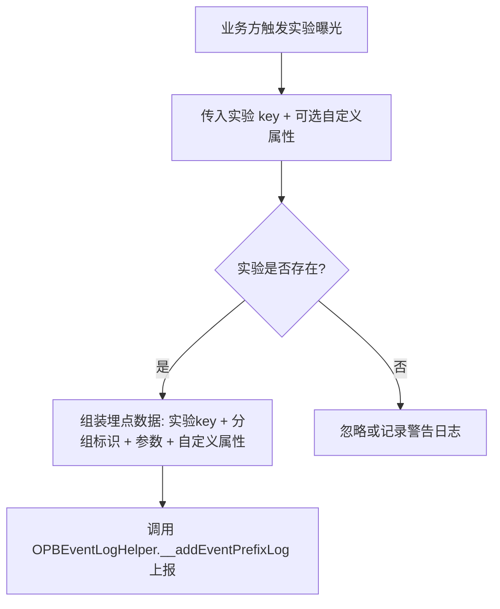

# PRD - ABTest SDK

## 文档信息

| 字段 | 内容 |
|------|------|
| 文档版本 | v2.0 |
| 创建日期 | 2026-07-06 |
| 项目名称 | MSCustomAi ABTest SDK |
| 状态 | 草稿 |

---

## 1. 项目概述

### 1.1 项目背景

公司各业务线需要 AB 实验能力来验证产品方案效果。当前缺少统一的客户端 AB 实验基础设施，各业务线各自实现导致分组逻辑不一致、实验数据不可靠、维护成本高。需要在现有 iOS 组件库 MSCustomAi 中新增一个 ABTest SDK，为各业务线提供统一的实验分组、参数下发、曝光埋点能力。

### 1.2 项目目标

- 提供统一的 AB 实验管理能力，支持随机分组、白名单强制分组、多层实验叠加运行
- 通过后端 API 拉取实验配置和参数，支持本地缓存和默认值兜底
- 对接现有埋点系统，自动/手动上报实验曝光事件
- 降低业务线接入成本，提供简洁的读取和埋点接口

### 1.3 目标用户

- **公司内部各业务线 iOS 开发者**：接入 SDK 进行 AB 实验，读取实验参数控制业务行为
- **数据分析师**（间接用户）：依赖 SDK 上报的曝光埋点数据进行实验效果分析

---

## 2. 功能需求

### 2.1 模块一：实验配置管理（P0）

#### F-001 服务端实验配置拉取

- **优先级**：P0
- **用户故事**：作为业务线开发者，我想要 SDK 自动从后端拉取最新的实验配置，以便于客户端始终获取到最新的分组结果和实验参数。
- **功能描述**：从服务端异步拉取完整的实验配置数据（包含实验列表、分组信息、实验参数）。拉取过程不阻塞业务方的读取操作。
- **验收标准**：
  - Given SDK 已初始化，When 触发配置拉取，Then 异步发起网络请求且不阻塞当前线程
  - Given 网络请求成功，When 服务端返回实验配置，Then 内存中的实验数据更新为最新值
  - Given 网络请求失败，When 请求超时或服务端错误，Then 保持使用当前已有数据（缓存或默认值），不影响业务正常运行

#### F-002 本地缓存管理

- **优先级**：P0
- **用户故事**：作为业务线开发者，我想要实验配置在网络获取成功后自动缓存到本地，以便于下次启动时无需等待网络即可使用真实数据。
- **功能描述**：网络获取成功后，将服务端返回的实验配置数据持久化到本地。下次启动时优先从缓存读取。
- **验收标准**：
  - Given 网络获取实验数据成功，When 数据返回后，Then 数据自动持久化到本地缓存
  - Given 本地已有缓存数据，When 下次启动读取实验配置，Then 优先返回缓存数据而非默认值
  - Given 本地缓存数据存在，When 网络重新获取到新数据，Then 缓存数据被更新为最新数据
  - Given 缓存数据损坏或格式不兼容，When 读取缓存，Then 回退到默认值，不崩溃

#### F-003 默认值配置

- **优先级**：P0
- **用户故事**：作为业务线开发者，我想要为实验预配置默认值，以便于首次启动无缓存且网络未就绪时有合理的兜底行为。
- **功能描述**：支持预定义一组实验的默认值（键值对形式），作为缓存和网络数据均不可用时的兜底。
- **验收标准**：
  - Given 已配置实验 "exp_btn_color" 的默认值为 "blue"，When 首次启动且无缓存时读取该实验，Then 返回 "blue"
  - Given 未配置任何默认值，When 读取某个实验的值，Then 返回空字符串
  - Given 本地有缓存数据，When 读取实验值，Then 返回缓存值而非默认值

#### F-004 数据加载优先级策略

- **优先级**：P0
- **用户故事**：作为业务线开发者，我想要实验数据的加载遵循明确的优先级策略，以便于在各种场景下都能获取到最合理的数据。
- **功能描述**：数据加载优先级为：缓存数据 > 默认值。网络获取成功后同时更新内存和缓存。
- **验收标准**：
  - Given 首次启动且无缓存，When 读取实验数据，Then 返回预配置的默认值
  - Given 首次启动后网络获取成功，When 再次读取同一实验，Then 返回网络获取的真实数据
  - Given 非首次启动且有缓存，When 读取实验数据，Then 返回缓存数据
  - Given 非首次启动且网络获取到新数据，When 新数据与缓存不同，Then 内存和缓存均更新为新数据

### 2.2 模块二：实验分组（P0）

#### F-005 随机分组

- **优先级**：P0
- **用户故事**：作为业务线开发者，我想要 SDK 根据服务端下发的分组配置将用户分配到对应实验组，以便于获取当前用户所在分组的实验参数。
- **功能描述**：根据服务端返回的分组结果（用户所属实验组），SDK 解析并暴露给业务方。分组逻辑由服务端执行，客户端仅负责读取分组结果。
- **验收标准**：
  - Given 服务端返回用户属于实验 "exp_home_layout" 的 "B组"，When 读取该实验分组，Then 返回 "B"
  - Given 用户未被分配到某实验，When 读取该实验分组，Then 返回默认组标识或空值

#### F-006 白名单强制分组

- **优先级**：P0
- **用户故事**：作为业务线开发者，我想要支持白名单强制分组，以便于测试人员或特定用户能固定在某个实验组中，方便测试和验证。
- **功能描述**：服务端下发的实验配置中包含白名单信息。当当前用户命中白名单时，强制使用白名单指定的分组，忽略随机分组结果。
- **验收标准**：
  - Given 用户 ID 在实验 "exp_pay_flow" 的白名单中且指定为 "A组"，When 读取该实验分组，Then 返回 "A"，忽略随机分组结果
  - Given 用户 ID 不在白名单中，When 读取该实验分组，Then 使用服务端的随机分组结果
  - Given 白名单信息随配置更新变化，When 用户从白名单中移除，Then 下次拉取配置后使用随机分组结果

#### F-007 多层实验叠加运行

- **优先级**：P0
- **用户故事**：作为业务线开发者，我想要多个实验能够同时运行且互不干扰，以便于同一用户可以同时参与多个不同业务的 AB 实验。
- **功能描述**：支持多个实验同时生效，每个实验独立管理分组和参数。不同实验之间不存在互斥关系（除非服务端配置了互斥层）。
- **验收标准**：
  - Given 用户同时参与实验 "exp_home" 和 "exp_pay"，When 分别读取两个实验的分组和参数，Then 各自返回正确的分组和参数值，互不干扰
  - Given 服务端配置了互斥层（同层实验互斥），When 用户在该层只命中一个实验，Then 该层仅返回命中实验的分组结果
  - Given 实验 A 和实验 B 在不同层，When 用户同时命中两个实验，Then 两个实验同时生效

### 2.3 模块三：实验参数读取（P0）

#### F-008 实验参数同步读取

- **优先级**：P0
- **用户故事**：作为业务线开发者，我想要通过简洁的接口同步读取实验参数值，以便于在业务代码中快速接入 AB 实验能力。
- **功能描述**：提供统一的读取接口，业务方通过实验名称（key）获取对应的实验参数值。读取为同步操作，从内存直接返回。
- **验收标准**：
  - Given 实验 "exp_btn_color" 存在且值为 "red"，When 通过 key 读取，Then 返回 "red"
  - Given 实验 key 不存在，When 通过该 key 读取，Then 返回业务方指定的 fallback 值或空字符串
  - Given SDK 已初始化，When 在任意线程调用读取接口，Then 能同步安全返回结果

#### F-009 实验分组标识读取

- **优先级**：P0
- **用户故事**：作为业务线开发者，我想要能读取当前用户在某个实验中的分组标识（如 A/B/C），以便于根据分组决定业务逻辑走向。
- **功能描述**：提供通过实验 key 读取当前用户分组标识的接口。
- **验收标准**：
  - Given 用户在实验 "exp_home" 中被分到 "B组"，When 读取该实验分组标识，Then 返回 "B"
  - Given 用户未参与某实验，When 读取该实验分组标识，Then 返回空或默认组标识

### 2.4 模块四：曝光埋点上报（P1）

#### F-010 实验曝光埋点

- **优先级**：P1
- **用户故事**：作为业务线开发者，我想要 SDK 提供实验曝光埋点能力，以便于数据分析师能统计实验的实际曝光量和分组分布。
- **功能描述**：当业务方触发实验曝光时，SDK 通过现有埋点系统（OPBEventLogHelper.__addEventPrefixLog）上报实验曝光事件。上报内容包含实验 key、分组标识、实验参数等信息。
- **验收标准**：
  - Given 业务方调用曝光上报接口，When 传入实验 key，Then SDK 通过 OPBEventLogHelper.__addEventPrefixLog 上报包含实验 key、分组标识的曝光事件
  - Given 同一实验在同一页面生命周期内，When 多次触发曝光，Then 可按策略去重（仅上报首次）或全量上报（由业务方决定）

#### F-011 自定义埋点属性扩展

- **优先级**：P2
- **用户故事**：作为业务线开发者，我想要在曝光埋点中附加自定义业务属性，以便于丰富实验数据维度。
- **功能描述**：曝光上报接口支持传入额外的自定义属性字典，与实验基础信息合并后上报。
- **验收标准**：
  - Given 业务方调用曝光接口时传入自定义属性 {"page": "home"}，When 上报埋点，Then 上报数据中同时包含实验基础信息和自定义属性

### 2.5 模块五：SDK 生命周期管理（P0）

#### F-012 SDK 初始化

- **优先级**：P0
- **用户故事**：作为业务线开发者，我想要通过简单的初始化调用完成 SDK 启动，以便于快速集成 ABTest 能力。
- **功能描述**：提供初始化入口，业务方传入必要的配置（如用户标识、默认值等），SDK 完成缓存加载和异步网络拉取。
- **验收标准**：
  - Given 业务方调用初始化接口并传入用户标识和默认值，When 初始化完成，Then SDK 加载缓存数据到内存并异步拉取最新配置
  - Given 初始化时未传入用户标识，When 调用初始化，Then SDK 正常启动但分组相关功能受限，读取返回默认值

#### F-013 用户标识更新

- **优先级**：P1
- **用户故事**：作为业务线开发者，我想要在用户登录/登出时更新 SDK 的用户标识，以便于切换用户后能拉取到新用户的实验配置。
- **功能描述**：提供用户标识更新接口。更新后自动触发重新拉取实验配置。
- **验收标准**：
  - Given 用户登录后调用更新用户标识接口，When 传入新用户 ID，Then SDK 自动重新拉取该用户的实验配置
  - Given 用户登出，When 调用清除用户标识，Then SDK 清除当前实验数据和缓存

#### F-014 手动刷新配置

- **优先级**：P1
- **用户故事**：作为业务线开发者，我想要能手动触发实验配置刷新，以便于在特定时机（如页面切换、特殊事件）获取最新配置。
- **功能描述**：提供手动刷新接口，调用后异步拉取最新实验配置。
- **验收标准**：
  - Given 业务方调用刷新接口，When 网络请求成功，Then 内存和缓存均更新为最新数据
  - Given 刷新过程中业务方读取实验值，When 刷新尚未完成，Then 返回当前内存中的旧数据，不阻塞

### 2.6 模块六：接入文档（P1）

#### F-015 接入文档与使用示例

- **优先级**：P1
- **用户故事**：作为业务线开发者，我想要有清晰的接入文档和使用示例，以便于快速理解如何集成和使用 ABTest SDK。
- **功能描述**：提供 SDK 的初始化、读取、埋点等核心场景的使用示例。
- **验收标准**：
  - Given 开发者首次接入 ABTest SDK，When 查阅文档，Then 能在 15 分钟内完成基本集成
  - Given 示例代码，When 按照示例编写业务代码，Then 代码可正常编译和运行

---

## 3. 非功能需求

### 3.1 性能要求

| 指标 | 要求 |
|------|------|
| 实验参数读取响应时间 | 同步读取，< 1ms（内存操作） |
| 网络请求超时 | <= 10s |
| 缓存读取耗时 | < 50ms |
| 内存占用 | 实验数据内存占用 < 2MB |
| SDK 初始化耗时 | < 100ms（不含网络请求） |

### 3.2 可靠性要求

| 指标 | 要求 |
|------|------|
| 网络失败降级 | 网络不可用时 100% 使用缓存或默认值兜底，不崩溃 |
| 数据一致性 | 缓存数据与最近一次网络成功获取的数据一致 |
| 线程安全 | 多线程并发读取不崩溃，数据不错乱 |
| 埋点可靠性 | 曝光埋点不丢失，对接现有埋点系统的可靠性保障 |

### 3.3 安全要求

| 指标 | 要求 |
|------|------|
| 数据传输 | 网络请求使用 HTTPS |
| 用户标识 | 用户标识不明文存储在日志或埋点中（如需脱敏由埋点系统处理） |

### 3.4 兼容性要求

| 指标 | 要求 |
|------|------|
| iOS 版本 | >= 12.0（与 MSCustomAi 组件库一致） |
| Swift 版本 | 5.0+ |
| 依赖 | 仅使用项目已有依赖（OPBJARVIS、SwiftTheme、OPBStorageHelper 等） |

---

## 4. 数据需求

### 4.1 核心数据实体

| 实体 | 说明 |
|------|------|
| 实验配置（Experiment） | 一个实验的完整配置，包含实验 key、实验层、分组列表、参数、白名单、启停状态 |
| 实验分组（Group） | 实验中的一个分组，包含分组标识和该组的实验参数 |
| 实验层（Layer） | 用于实现多层实验叠加，同层实验互斥，不同层实验可叠加 |
| 白名单条目（Whitelist Entry） | 将特定用户强制分配到指定实验组 |
| 曝光事件（Exposure Event） | 实验曝光埋点数据，包含实验 key、分组标识、时间戳、自定义属性 |

### 4.2 数据关系

- 一个实验层包含多个实验，同层内用户只能命中一个实验
- 一个实验包含多个分组，用户属于其中一个分组
- 一个实验可包含多个白名单条目
- 一次曝光事件关联一个实验和一个分组

### 4.3 数据生命周期

| 阶段 | 说明 |
|------|------|
| 创建 | 默认值在初始化时注入；缓存数据在网络获取成功后写入 |
| 读取 | 业务方通过实验 key 同步读取分组和参数 |
| 更新 | 网络获取成功时更新内存和缓存；用户标识变更时重新拉取 |
| 删除 | 用户登出时清除缓存（遵循项目已有缓存清理机制） |

---

## 5. 约束与假设

### 5.1 约束

- **技术约束**：使用 Swift 语言，遵循项目现有编码规范（OPBUIViewController 继承、SwiftTheme 适配、懒加载用 `it`、不用下划线开头等）
- **依赖约束**：使用项目已有的 OPBStorageHelper 做持久化，使用 OPBJARVIS 的 OPBBaseRequest 做网络请求
- **埋点约束**：对接现有 OPBEventLogHelper.__addEventPrefixLog(eventName:, attributes:) 埋点系统
- **代码位置**：源码放在 MSCustomAi/Classes/ 目录下
- **路由约束**：如涉及页面跳转使用 OPRouter

### 5.2 假设

- 服务端已提供 AB 实验配置查询接口，返回包含实验层、分组、参数、白名单的完整配置
- 实验分组的随机算法由服务端执行，客户端仅读取分组结果
- 服务端负责实验层的互斥逻辑，客户端按层解析即可
- 实验配置数据量适中（通常不超过 50 个实验，每个实验不超过 10 个分组），不会造成存储或内存压力

---

## 6. 里程碑

| 阶段 | 内容 | 交付物 |
|------|------|--------|
| M1 | 核心配置管理 + 分组能力（F-001 ~ F-009, F-012） | 实验配置拉取、缓存、默认值、随机分组、白名单、多层实验、参数读取、初始化 |
| M2 | 曝光埋点 + 生命周期（F-010, F-013, F-014） | 曝光埋点上报、用户标识更新、手动刷新 |
| M3 | 扩展能力 + 文档（F-011, F-015） | 自定义埋点属性、接入文档和使用示例 |

---

## 7. 风险评估

| 风险 | 影响 | 等级 | 缓解措施 |
|------|------|------|----------|
| 服务端 AB 实验接口未就绪 | 无法完成网络获取和分组功能的联调 | 高 | 使用 Mock 数据进行开发和测试，提前约定接口协议 |
| 多层实验叠加逻辑复杂 | 客户端解析逻辑出错导致分组异常 | 中 | 分组逻辑由服务端完成，客户端仅做结果解析，降低客户端复杂度 |
| 缓存数据格式变更 | 旧缓存数据无法解析 | 低 | 缓存读取失败时回退到默认值 |
| 多线程并发读写冲突 | 数据不一致或崩溃 | 中 | 读取接口需保证线程安全 |
| 埋点数据丢失 | 实验曝光数据不完整影响分析结论 | 中 | 依赖现有埋点系统可靠性保障，SDK 层面确保调用正确 |
| 白名单数据量过大 | 影响配置拉取和解析性能 | 低 | 白名单匹配仅对当前用户 ID 做判断，不需加载全量白名单 |

---

## 8. 核心业务流程

### 8.1 SDK 初始化与数据加载流程

### 8.2 实验参数读取流程

### 8.3 曝光埋点上报流程

---

## 9. 领域词汇表

| 术语 | 定义 |
|------|------|
| AB 实验（A/B Test） | 一种对比实验方法，将用户随机分为不同组，展示不同方案以评估效果 |
| 实验（Experiment） | 一次 AB 测试配置，包含实验 key、所属层、分组列表、参数、白名单等 |
| 实验层（Layer） | 实验的分层机制，同层实验互斥（用户只能命中一个），不同层实验可叠加 |
| 分组（Group） | 实验中的一个变体方案，如 A 组（对照组）、B 组（实验组） |
| 分组标识（Group ID） | 分组的唯一标识，如 "A"、"B"、"control" |
| 白名单（Whitelist） | 将特定用户强制分配到指定实验组的名单，用于测试和灰度 |
| 实验参数（Parameter） | 分组下的具体配置值，如按钮颜色、文案等 |
| 曝光（Exposure） | 用户实际看到/使用了某个实验方案，需上报埋点用于数据分析 |
| 默认值（Default Value） | 客户端预配置的实验初始值，在无缓存且未获取网络数据时使用 |
| 缓存数据（Cached Data） | 网络获取成功后持久化到本地的实验配置数据 |
